# The structure of the challenge

|                            |                         |                            |                             |                           |
|----------------------------|-------------------------|----------------------------|-----------------------------|---------------------------|
| [01 part-to-whole](#day-1) | [07 physical](#day-7)   | [13 correlation](#day-13)  | [19 global change](#day-19) | [25 demographic](#day-25) |
| [02 pictogram](#day-2)     | [08 animals](#day-8)    | [14 space](#day-14)        | [20 upwards](#day-20)       | [26 trends](#day-26)      |
| [03 historical](#day-3)    | [09 statistics](#day-9) | [15 multivariate](#day-15) | [21 downwards](#day-21)     | [27 educational](#day-27) |
| [04 magical](#day-4)       | [10 abstract](#day-10)  | [16 trees](#day-16)        | [22 animation](#day-22)     | [28 future](#day-28)      |
| [05 slope](#day-5)         | [11 circular](#day-11)  | [17 pop culture](#day-17)  | [23 tiles](#day-23)         | [29 deviations](#day-29)  |
| [06 experimental](#day-6)  | [12 strips](#day-12)    | [18 connections](#day-18)  | [24 monochrome](#day-24)    | [30 3D](#day-30)          |

# comparisons

## Day 1

2021-04-01 \| part-to-whole \|
[tweet](https://twitter.com/ikashnitsky/status/1377641808998625280) \|
[code](/src/01-part-to-whole-top100altmetric.R)

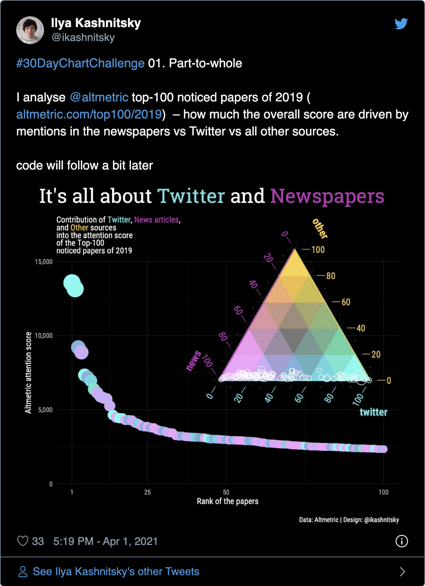<!-- -->

## Day 2

2021-04-02 \| pictogram \|
[tweet](https://twitter.com/ikashnitsky/status/1378099699698262017)

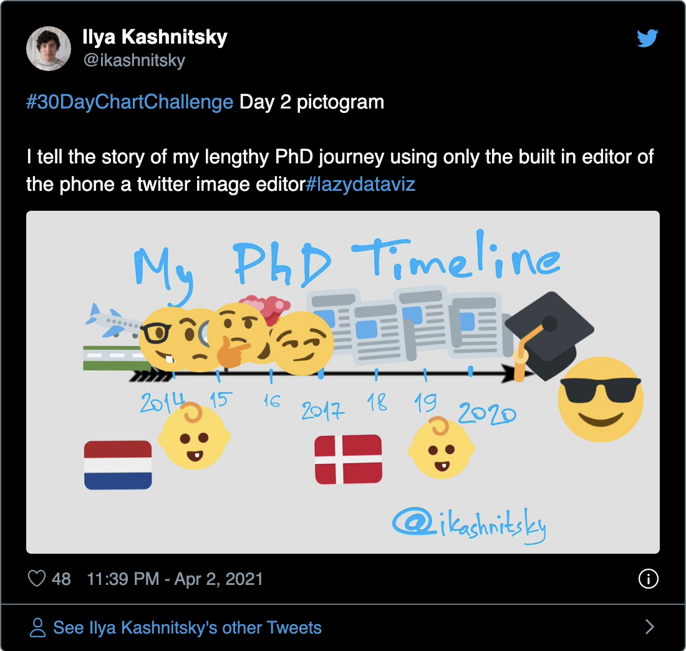<!-- -->

## Day 3

2021-04-03 \| historical \|
[tweet](https://twitter.com/ikashnitsky/status/1378251035144245250) \|
[code](https://github.com/OxfordDemSci/ex2020)

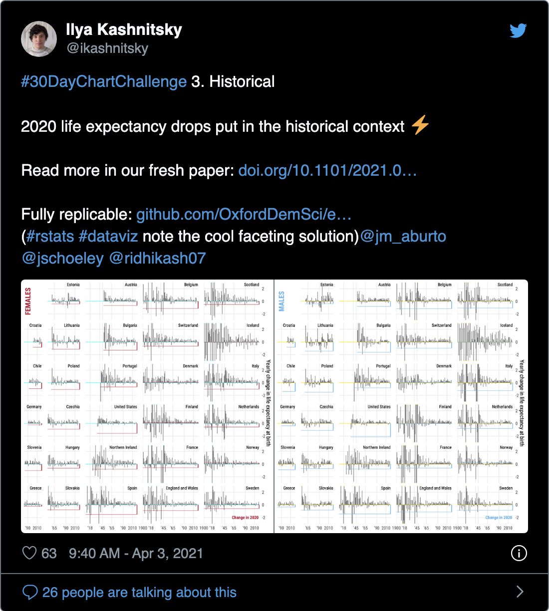<!-- -->

## Day 4

2021-04-04 \| magical \|
[tweet-1](https://twitter.com/ikashnitsky/status/1378673154730647555) \|
[tweet-2](https://twitter.com/ikashnitsky/status/1379398990266048512) \|
[code](/src/04-magic.R)

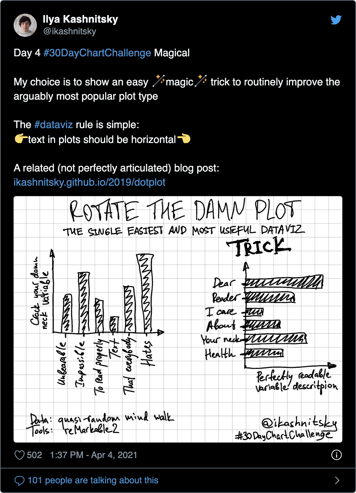<!-- -->

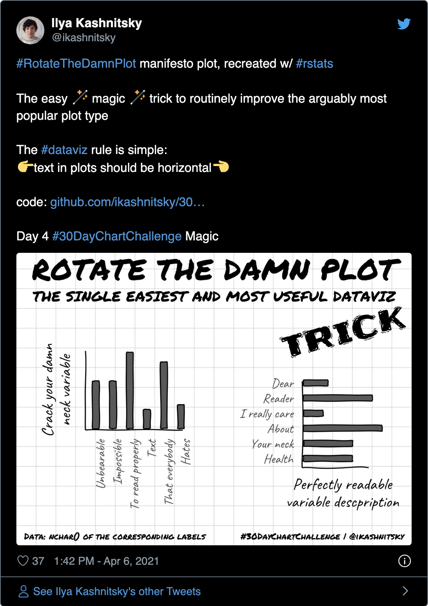<!-- -->

## Day 5

2021-04-05 \| slope \|
[tweet](https://twitter.com/ikashnitsky/status/1379025851317161985) \|
[code](/src/05-slope-best-life-expectancy.R)

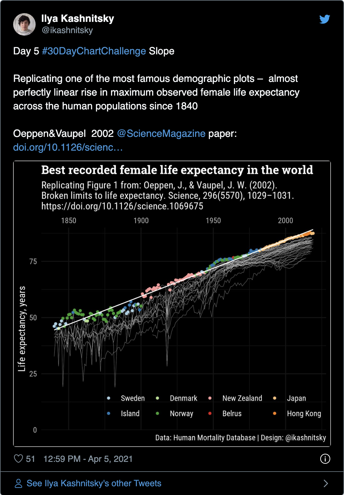<!-- -->

## Day 6

2021-04-06 \| experimental \|
[tweet](https://twitter.com/ikashnitsky/status/1379316226267156481) \|
[code](/scr/06-experiment.R)

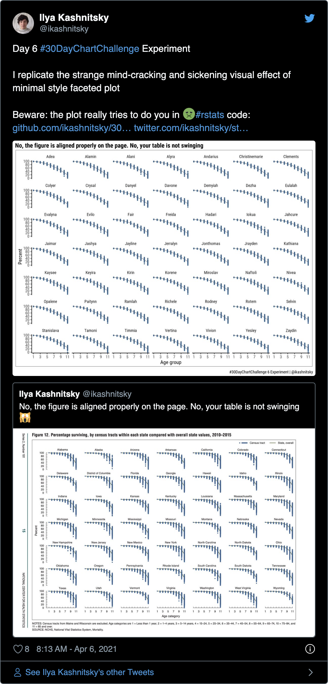<!-- -->

# distributions

## Day 7

2021-04-07 \| physical \|
[tweet](https://twitter.com/ikashnitsky/status/1379696769211195394)

<!-- -->

## Day 8

2021-04-08 \| animals \|
[tweet](https://twitter.com/ikashnitsky/status/1380063567735574528) \|
[code](/scr/08-animal-milk.R)

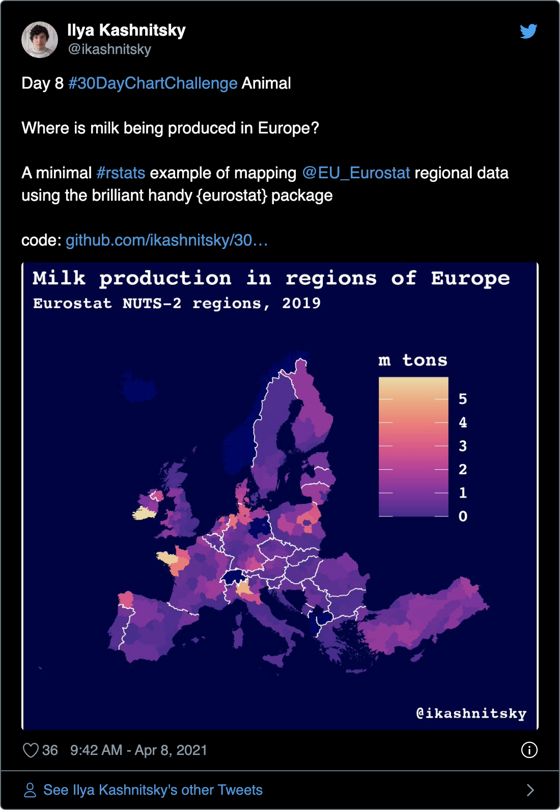<!-- -->

## Day 9

2021-04-09 \| statistics \|
[tweet](https://twitter.com/ikashnitsky/status/1380612409455476742) \|
[code](https://gist.github.com/ikashnitsky/654965cb971f3a11928806c4d0a0ef23)

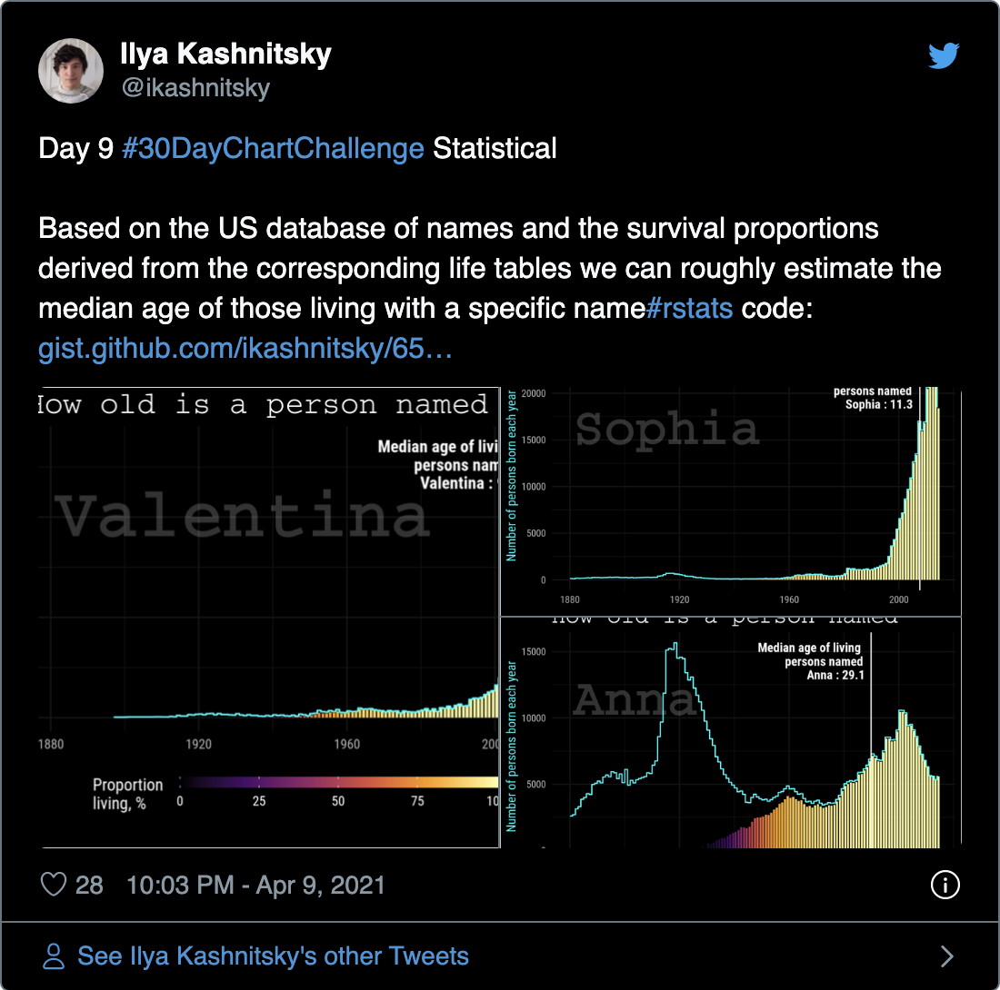<!-- -->

## Day 10

2021-04-10 \| abstract \|
[tweet](https://twitter.com/ikashnitsky/status/1380844964456849409) \|
[code](/scr/10-abstract.R)

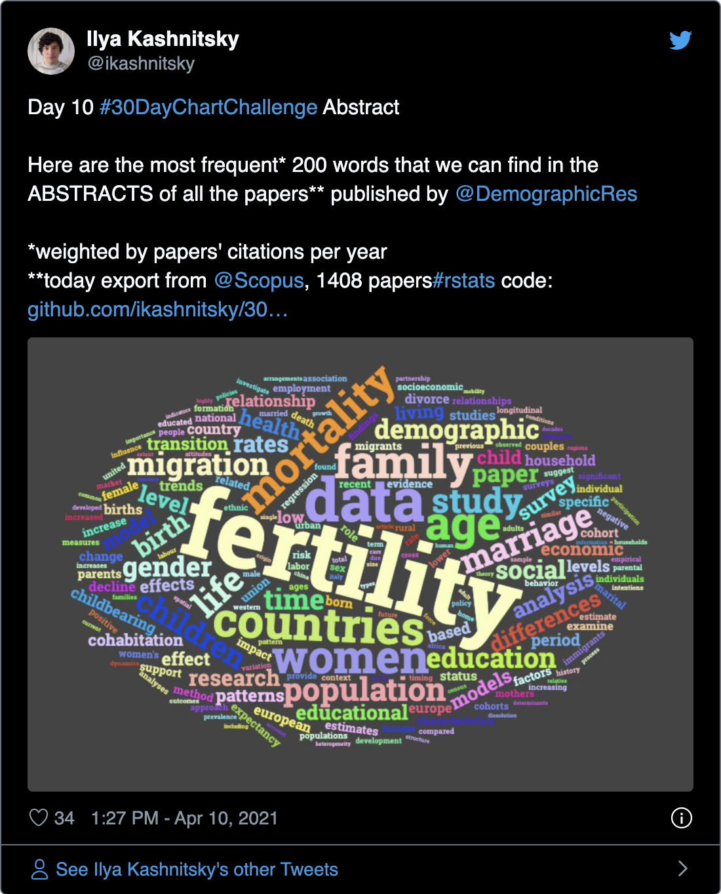<!-- -->

## Day 11

2021-04-11 \| circular \|
[tweet](https://twitter.com/ikashnitsky/status/1381356371657039874) \|
[code](/scr/11-circular-random-bubbles.R)

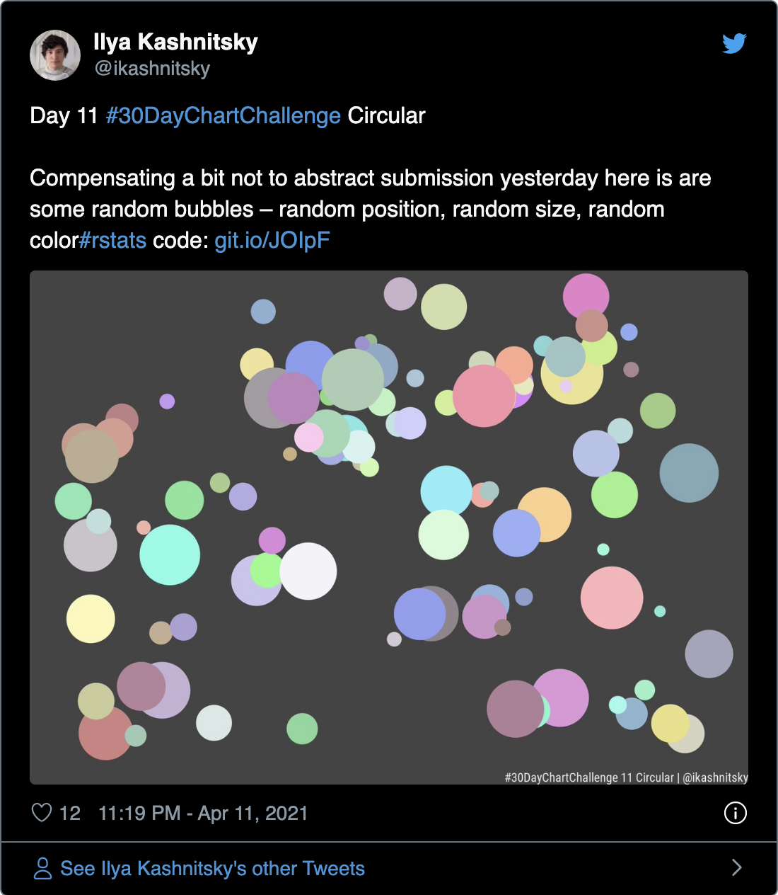<!-- -->

## Day 12

2021-04-12 \| strips

# relationships

## Day 13

2021-04-13 \| correlation

## Day 14

2021-04-14 \| space

## Day 15

2021-04-15 \| multivariate

## Day 16

2021-04-16 \| trees

## Day 17

2021-04-17 \| pop culture

## Day 18

2021-04-18 \| connections

# timeseries

## Day 19

2021-04-19 \| global change

## Day 20

2021-04-20 \| upwards

## Day 21

2021-04-21 \| downwards

## Day 22

2021-04-22 \| animation

## Day 23

2021-04-23 \| tiles

## Day 24

2021-04-24 \| monochrome

# uncertainties

## Day 25

2021-04-25 \| demographic

## Day 26

2021-04-26 \| trends

## Day 27

2021-04-27 \| educational

## Day 28

2021-04-28 \| future

## Day 29

2021-04-29 \| deviations

## Day 30

2021-04-30 \| 3D
