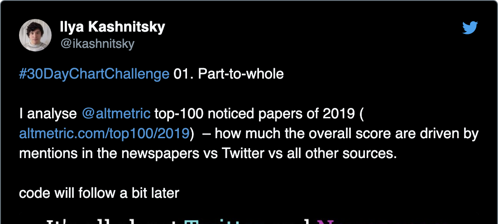
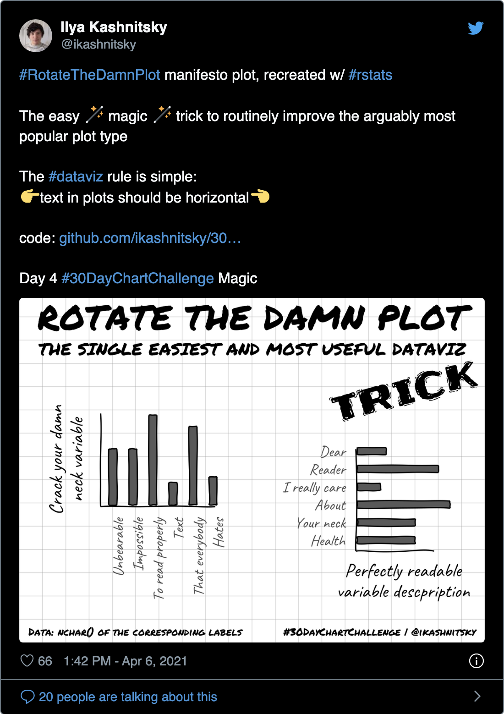
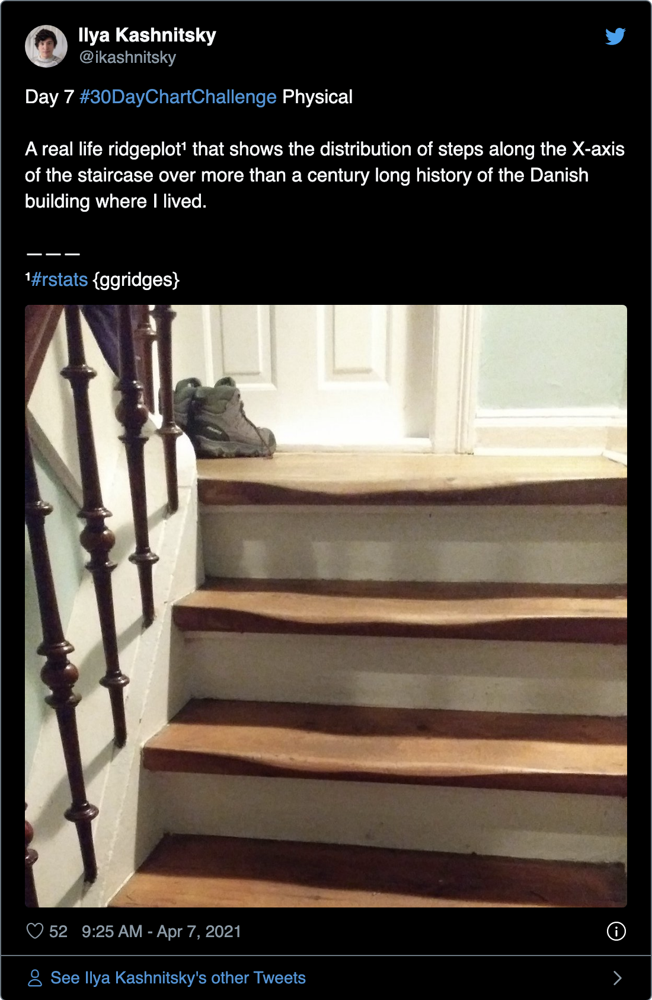

30DayChartChallenge – Ilya Kashnitsky – daily contributions to the
challenge
================

# The structure of the challenge


|                 |                   |                   |                   |                   |
|-----------------|-------------------|-------------------|-------------------|-------------------|
| [Day 1](#day-1) | [Day 7](#day-7)   | [Day 13](#day-13) | [Day 19](#day-19) | [Day 25](#day-25) |
| [Day 2](#day-2) | [Day 8](#day-8)   | [Day 14](#day-14) | [Day 20](#day-20) | [Day 26](#day-26) |
| [Day 3](#day-3) | [Day 9](#day-9)   | [Day 15](#day-15) | [Day 21](#day-21) | [Day 27](#day-27) |
| [Day 4](#day-4) | [Day 10](#day-10) | [Day 16](#day-16) | [Day 22](#day-22) | [Day 28](#day-28) |
| [Day 5](#day-5) | [Day 11](#day-11) | [Day 17](#day-17) | [Day 23](#day-23) | [Day 29](#day-29) |
| [Day 6](#day-6) | [Day 12](#day-12) | [Day 18](#day-18) | [Day 24](#day-24) | [Day 30](#day-30) |

# comparisons

## Day 1

2021-04-01 \| part-to-whole

<!-- -->

## Day 2

2021-04-02 \| pictogram

``` r
tweet_screenshot(tweet_url("ikashnitsky", "1378099699698262017"), theme = "dark")
```

<!-- -->

## Day 3

2021-04-03 \| historical

``` r
tweet_screenshot(tweet_url("ikashnitsky", "1378251035144245250"), theme = "dark")
```

<!-- -->

## Day 4

2021-04-04 \| magical

``` r
tweet_screenshot(tweet_url("ikashnitsky", "1378673154730647555"), theme = "dark")
```

<!-- -->

``` r
tweet_screenshot(tweet_url("ikashnitsky", "1379398990266048512"), theme = "dark")
```

<!-- -->

## Day 5

2021-04-05 \| slope

``` r
tweet_screenshot(tweet_url("ikashnitsky", "1379025851317161985"), theme = "dark")
```

<!-- -->

## Day 6

2021-04-06 \| experimental

``` r
tweet_screenshot(tweet_url("ikashnitsky", "1379316226267156481"), theme = "dark")
```

<!-- -->

# distributions

## Day 7

2021-04-07 \| physical

<!-- -->
